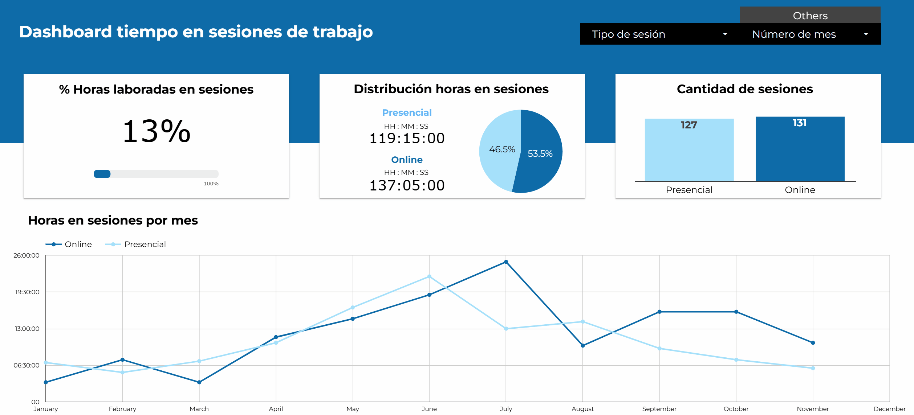
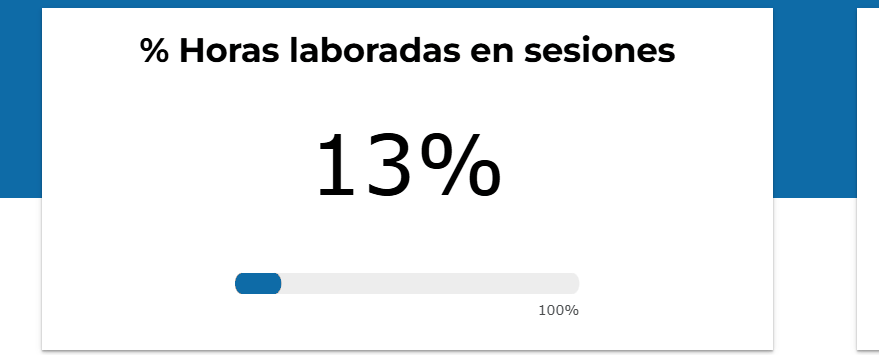

  

## 📊 Introduction
This project presents a database tracking the time spent in work sessions. It compares the time invested in in-person sessions (such as work meetings, collaborative sessions in meeting rooms, etc.) versus online sessions (such as presentations of dashboards or meetings with remote colleagues).

The data was recorded in **Google Sheets** based on sessions scheduled in **Google Calendar**, and the dashboard was created using **Google Looker Studio**.

## 📈 Final Dashboard
My final dashboard can be accessed at the following link:  
[Dashboard on Looker Studio](https://lookerstudio.google.com/reporting/cb6ba335-319e-4b22-9fac-7c2b53419d45)

## 🧑‍💻 Excel / Google Sheets Skills Used
### • Formulas:
Some of the formulas used to process the data include:
- MONTH
- NETWORKDAYS.INTL
- SUM
- FILTER
- HOUR
- SECOND
- MINUTE

### • Dropdown List:
For recording session types, I used a dropdown list with two values: **In-Person** and **Online**.

## 📊 Creating the Dashboard
### • Charts:
#### Percentage of hours worked vs hours in sessions:
  

- ⚙️ **Looker Studio Features:** A Scorecard was used to represent the total percentage, followed by a progress bar to show the measure toward 100%.
- 🎨 **Color selection:** Colors were chosen based on the visual identity of the dashboard.
- 💡 **Knowledge gained:** This dashboard helped me quickly identify the impact of the number of sessions on my work, showing how much time I spent in sessions compared to my total working hours.

#### Distribution of hours in sessions:  
  

- ⚙️ **Looker Studio Features:** A pie chart was used to represent the comparison between hours spent in in-person sessions and hours spent online.  
- 🎨 **Color selection:** A blue gradient was used to represent the comparison between both percentages.  
- 💡 **Knowledge gained:** By identifying the percentage of time invested in sessions, I was able to see the breakdown of this distribution, comparing the two types of sessions. Additionally, the number of hours was included to better understand the time spent during the month.  
- ✨ **Special Features:** To properly visualize the distribution of hours, minutes, and seconds in Looker Studio, the source data must be converted into seconds, as Looker Studio does not natively transform these time formats.
